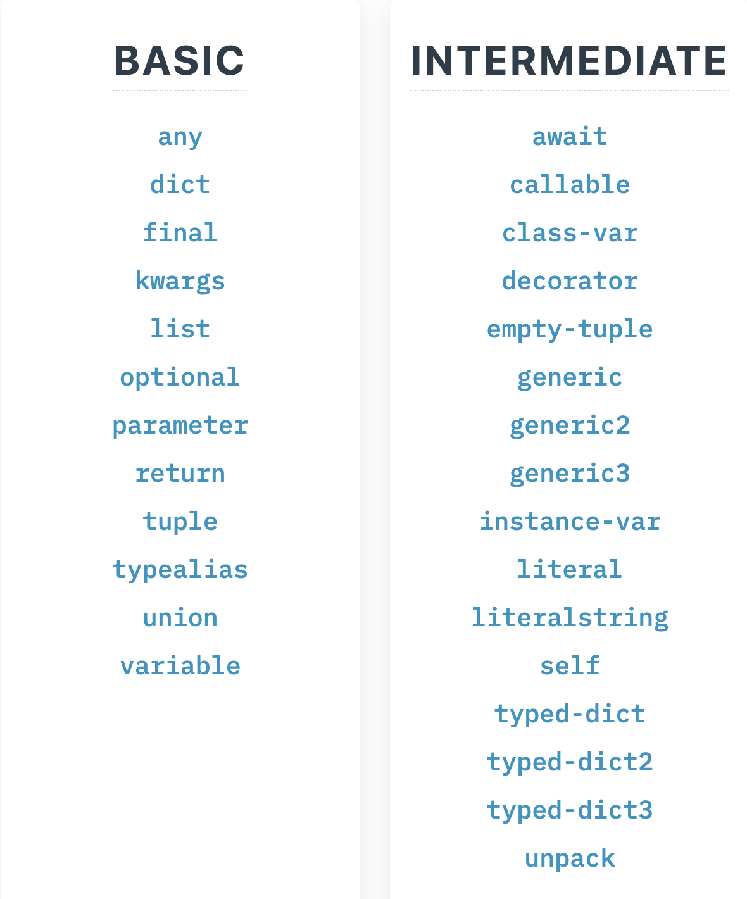

## Тренажер по аннотации типов

***

*Задание*: пройти максимальное количество упраженений на аннотацию типов в
тренаржере https://python-type-challenges.zeabur.app
***
*Цель задания*: набить руку на стандартных (и не очень) кейсам по типизации, попробовать на практике различные
возможности языка по аннотации
***
*Критерии успеха*: задание __обязательно__ вплоть до продвинутого уровня вопросов (т.е. нужно сделать хотя бы Basic и
Intermediate), ступени Advanced и Extreme являются __опциональными__
***
__Оформление__

Настроить CI, который будет проверять аннотоции с помощью `mypy` или `pyright`, а также обеспечить условия, при которых
в локальном репозитории по команде `make typing` в контейнере запускалась бы аналогичная проверка типов.
***

Проверка типов - с помощью mypy.

Уровни: basic (basic.py), intermediate (intermediate.py).

Проверка локально: `mypy basic.py intermediate.py`

Проверка в контейнере: `docker run --rm -v $(PWD)/hw_02 hw02_image mypy basic.py intermediate.py`
