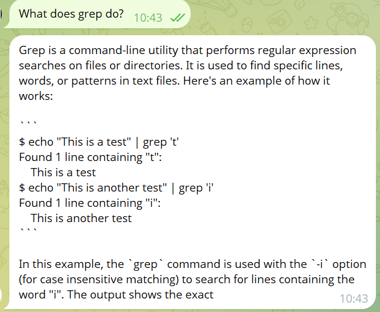
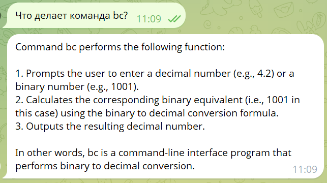
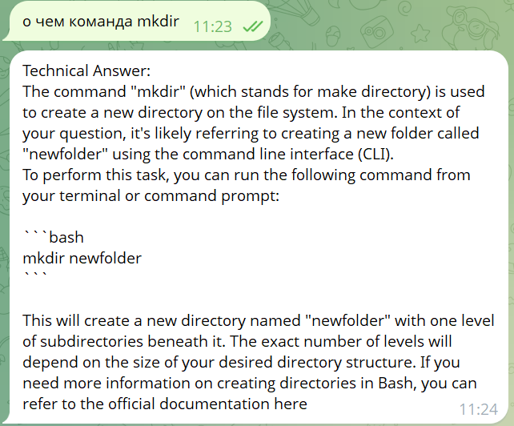

### OTUS-GPT
***
Цель:

Настроить предобученную GPT-like модель


Описание/Пошаговая инструкция выполнения домашнего задания:

В данном домашнем задании предлагается выбрать на свое усмотрение одну из открытых генеративных моделей на HuggingFace, донастроить его под интересующий кейс и реализовать своего бота\агента или даже сеть\цепь агентов
***
# Linux Command Chatbot with Fine-Tuned TinyLlama

A Telegram chatbot that explains Linux commands using a fine-tuned TinyLlama model with LoRA adapters.

## Overview

This project demonstrates:
- Fine-tuning an open-source LLM using PEFT/LoRA
- Creating a dataset from web resources (HTML parsing)
- Building a practical Telegram bot application
- Running ML training on Google Colab free tier or locally MacBook M1/M2

### Key Features
- **Multilingual Input**: Accepts questions in English or Russian
- **English-Only Responses**: Always answers in English (enforced via prompt design)
- **Efficient Training**: LoRA adapters (~18MB) instead of full model retraining
- **Educational**: Clear, reproducible pipeline suitable for academic evaluation

### Dataset
- **Source**: [101 Linux Commands by Bobby Iliev](https://github.com/bobbyiliev/101-linux-commands)
- **Format**: Instruction-following JSONL
- **Size**: ~500 examples (100 commands × 3 question variations)
- **Generation**: Fully automated from HTML parsing

### Training Configuration
- **Hardware**: Google Colab T4 GPU (free tier) or local MacBook M1/M2
- **Training Time**: ~30-45 minutes
- **Quantization**: 4-bit (NF4) for memory efficiency
- **Optimizer**: 8-bit paged AdamW
- **Learning Rate**: 2e-4 with cosine schedule
- **Epochs**: 3
- **Effective Batch Size**: 16

### Step 1: Training the Model (Optional)

> **Note**: Pre-trained LoRA adapters are included in the repository. You can skip training and proceed directly to inference or bot deployment.

1. Open `notebook/linux_command_trainer.ipynb` in Google Colab
2. Run all cells sequentially
3. **Training cell is marked as OPTIONAL** - skip if using pre-trained adapters
4. Download the generated `model/lora_adapters/` folder if you retrain

### Step 2: Testing Inference in Notebook

1. Navigate to Section 11 (Inference Testing) in the notebook
2. Run the inference cells to test the model
3. Try examples:
   - "Explain the ls command"
   - "What does grep do?"
   - "Что делает команда chmod?" (Russian input)

Expected output: Concise English explanations regardless of input language

### Step 3: Running the Telegram Bot
1. Put your Telegram bot token in the environment variable in the .env file
2. Run the bot using the provided script:
   ```bash
   ./bot/run.sh
   ```

### Telegram Bot Demo
*English question → English answer*



*Russian question → English answer*







## Learning Outcomes

This project demonstrates:
1. **Data Engineering**: Web scraping, parsing, cleaning, augmentation
2. **ML Training**: Fine-tuning with LoRA, hyperparameter tuning
3. **Prompt Engineering**: Designing prompts for consistent behavior
4. **ML Deployment**: Integrating models into real applications

## Acknowledgments

- **TinyLlama Team**: For the base model
- **Bobby Iliev**: For the "101 Linux Commands" tutorial
- **Hugging Face**: For transformers, PEFT, and model hosting
- **Google Colab**: For free GPU resources

## References

1. [TinyLlama Model Card](https://huggingface.co/TinyLlama/TinyLlama-1.1B-Chat-v1.0)
2. [PEFT Documentation](https://huggingface.co/docs/peft)
3. [LoRA Paper](https://arxiv.org/abs/2106.09685)
4. [101 Linux Commands](https://github.com/bobbyiliev/101-linux-commands)
5. [python-telegram-bot Documentation](https://docs.python-telegram-bot.org/)
---

